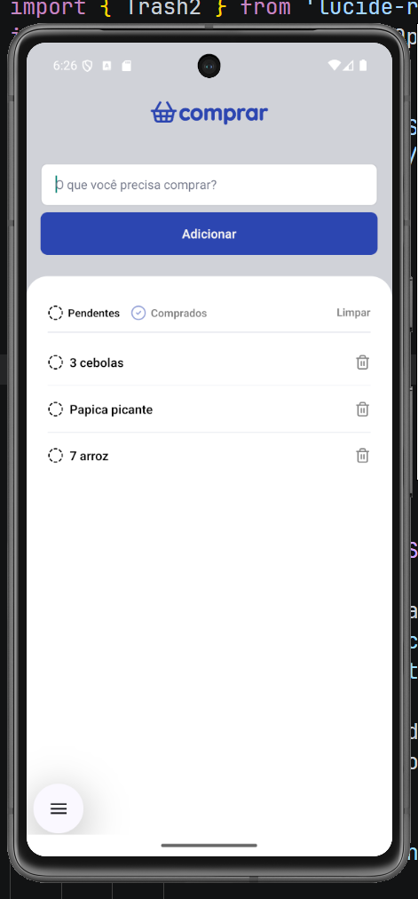

# Projeto lista de compras desenvolvido com a TII02

## comandos essenciais

- iniciar projeto senac!
```cmd
npx expo start --offline
```
- instalando pacotes essenciais
```cmd
npm install
```


## objetivo de hoje!
